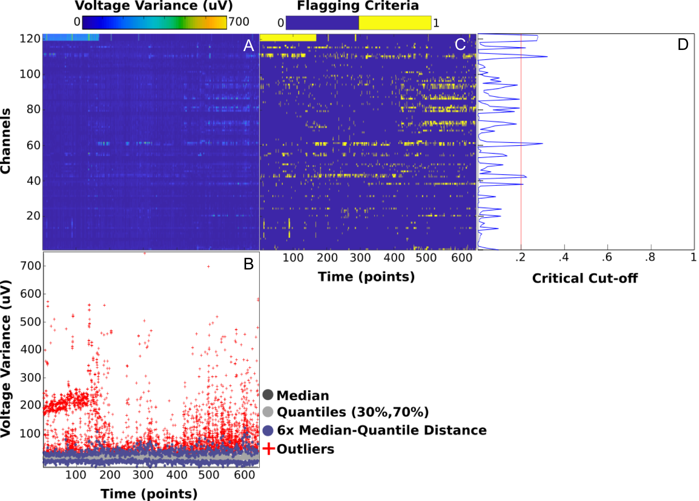
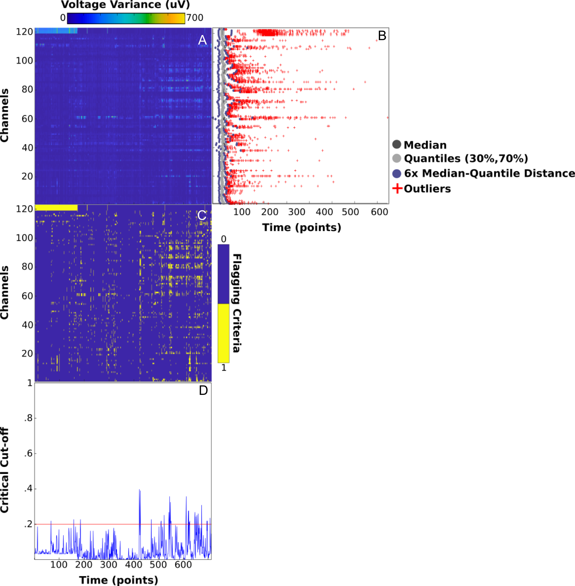

# Introduction to the Lossless Parameters

Each major stage in the Lossless pipeline has parameters that allow researchers to tune the pipeline's decision making criteria to a given dataset. These include adjusting how bad a channel must be before being rejected, as well as various Independant Component Analysis (ICA) settings such as setting a random seed, or which algorithm to use.

# Modifying Lossless Parameters

This section outlines how to load the default pipeline configuration file, edit parameters within a script, save a config to file, load a config from file, and finally using the modified (or default) config to run the Lossless pipeline. Subsequent sections will outline what the various parameters control.

Beginners to the Lossless pipeline should load the default config from script, save it without modification, and edit with a text editor like [Visual Studio Code](https://code.visualstudio.com/) that will respect formatting.

## Loading the Default Config

The below code block can be run inside of a Jupyter Notebook, or even in a simple python interpreter session to build the default config.

```python
import pylossless as ll
config = ll.config.Config()
config.load_default()
```

By printing, or displaying with Jupyter, you should be presented with the following:

```
{'project': {'readme': '# Description of the dataset', 'bids_montage': 'GSN-HydroCel-129', 'analysis_montage': '', 'set_montage_kwargs': {}, 'coordsys': {'EEGCoordinateSystem': 'Other', 'EEGCoordinateUnits': 'metres'}}, 'find_breaks': None, 'epoching': {'overlap': 0, 'epochs_args': {'baseline': None, 'tmax': 1, 'tmin': 0}}, 'filtering': {'filter_args': {'h_freq': 100, 'l_freq': 1}, 'notch_filter_args': {'freqs': [60]}}, 'nearest_neighbors': {'n_nbr_ch': 3, 'n_nbr_epoch': 3}, 'bridged_channels': {'bridge_trim': 40, 'bridge_z': 6}, 'noisy_channels': {'plot_diagnostic': False, 'flag_crit': 0.2, 'outlier_method': 'quantile', 'outliers_kwargs': {'k': 6, 'lower': 0.25, 'upper': 0.75}}, 'uncorrelated_channels': {'flag_crit': 0.2, 'outlier_method': 'quantile', 'outliers_kwargs': {'k': 6, 'lower': 0.25, 'upper': 0.75}}, 'noisy_epochs': {'plot_diagnostic': False, 'flag_crit': 0.2, 'outlier_method': 'quantile', 'outliers_kwargs': {'k': 6, 'lower': 0.25, 'upper': 0.75}}, 'uncorrelated_epochs': {'flag_crit': 0.2, 'outlier_method': 'quantile', 'outliers_kwargs': {'k': 6, 'lower': 0.25, 'upper': 0.75}}, 'ica': {'noisy_ic_epochs': {'plot_diagnostic': False, 'flag_crit': 0.2, 'outlier_method': 'quantile', 'outliers_kwargs': {'k': 6, 'lower': 0.25, 'upper': 0.75}}, 'ica_args': {'run1': {'method': 'fastica'}, 'run2': {'method': 'infomax', 'fit_params': {'extended': True}}}}}
```

## Editing the Configuration Programmatically

To edit a parameter within a script, treat it as a nested dictionary. For example, the default notch filter argument is 60hz as per North American standards. To change it to 50hz acces the notch filter variable as below:

```python
config['filtering']['notch_filter_args'] = 50
```

## Saving a Config Object

Saving is done from within a script. It is recommended to save configurations with names matching the project. For example, if the project is named "Face13", the file should be saved as `Face13.yaml`. Definitions and discussions of `.yaml` files can be found [here](https://en.wikipedia.org/wiki/YAML).

```python
config.save('Face13.yaml')
```

Note that this will save the file wherevere the current working directory is.

## Editing Parameters within an Editor

Once a configuration file has been saved, it can be edited as a plain text file in a much nicer format. Below is the output of saving the above structure:

```
bridged_channels:
    bridge_trim: 40
    bridge_z: 6
epoching:
    epochs_args:
        baseline: null
        tmax: 1
        tmin: 0
    overlap: 0
filtering:
    filter_args:
        h_freq: 100
        l_freq: 1
    notch_filter_args: 60
find_breaks: null
ica:
    ica_args:
        run1:
            method: fastica
        run2:
            fit_params:
                extended: true
            method: infomax
    noisy_ic_epochs:
        flag_crit: 0.2
        outlier_method: quantile
        outliers_kwargs:
            k: 6
            lower: 0.25
            upper: 0.75
        plot_diagnostic: false
nearest_neighbors:
    n_nbr_ch: 3
    n_nbr_epoch: 3
noisy_channels:
    flag_crit: 0.2
    outlier_method: quantile
    outliers_kwargs:
        k: 6
        lower: 0.25
        upper: 0.75
    plot_diagnostic: false
noisy_epochs:
    flag_crit: 0.2
    outlier_method: quantile
    outliers_kwargs:
        k: 6
        lower: 0.25
        upper: 0.75
    plot_diagnostic: false
project:
    analysis_montage: ''
    bids_montage: GSN-HydroCel-129
    coordsys:
        EEGCoordinateSystem: Other
        EEGCoordinateUnits: metres
    readme: '# Description of the dataset'
    set_montage_kwargs: {}
uncorrelated_channels:
    flag_crit: 0.2
    outlier_method: quantile
    outliers_kwargs:
        k: 6
        lower: 0.25
        upper: 0.75
uncorrelated_epochs:
    flag_crit: 0.2
    outlier_method: quantile
    outliers_kwargs:
        k: 6
        lower: 0.25
        upper: 0.75
```

Now, changing a parameter is as simple as editing the file.

## Running Lossless Based on a Changed Configuration

There are two main options outlined in the following subsections.

### Running Based on a Programmatic Change

```
import pylossless as ll
config = ll.config.Config()
config.load_default()

config['filtering']['notch_filter_args'] = 50

pipeline = ll.LosslessPipeline(config=config)
pipeline.run_with_raw(raw)
```

### Running Based on a Local File

```
pipeline = ll.LosslessPipeline('project_specific_name.yaml')
pipeline.run_with_raw(raw)
```

# Lossless Parameter Definitons

This section breaks down each major heading in the Lossless configuration file. Sections are in no particular order and may reference other documentation pages. Documentation for the parameters is available as inline comments on the fields.

## Parameters for: `project`

The `project` based parameters are mostly optional and control BIDS output fields. However, `analysis_montage` can be used as a last ditch attempt to forcibly load a montage on a file before the pipeline needs it.

```
project:
    analysis_montage: '' # Used to set a montage if the input file does not already have one set
    bids_montage: GSN-HydroCel-129 # BIDS output choice
    coordsys:
        EEGCoordinateSystem: Other # BIDS output choice
        EEGCoordinateUnits: metres # BIDS output choice
    readme: '# Description of the dataset' # BIDS output choice
    set_montage_kwargs: {} # Optional way for pipeline to pass through extra montage information. See code for details.
```

## Parameters for: `epoching`

The parameters in `epoching` control how the data is to be windowed for variance calculations.

Only expert users should adjust to not cause data loss.

```
epoching:
    epochs_args: # Baseline arguments for eeach window
        baseline: null
        tmax: 1
        tmin: 0
    overlap: 0 # Float, percent overlap
```

## Parameters for: `filtering`

Fields in `filtering` are, of course, used to control the pipeline's filtering options. Note that the pipeline has a `h_freq` limit of 100hz so that muscle activity can be picked up by ICA and removed.

```
filtering:
    filter_args:
        h_freq: 100
        l_freq: 1
    notch_filter_args: 60 # Can be a list for multiple if necessary
```

## Parameters for: `ica`

There are three main ICA configuration sections for the pipeline.

1. Control over the first ICA with `ica/ica_args/run1`
2. Also, control over the second ICA with `ica/ica_args/run2`
3. Criteria function control over which moments in time are outliers due to the first ICA failing to decompose bad time periods into minimal components. See documentation elsewhere for formal defitions and explanations of the criteria function.

ica:
    ica_args:
        run1:
            method: fastica # Not used to correct data, only find bad time in run1
        run2:
            fit_params:
                extended: true
            method: infomax
    noisy_ic_epochs: # Criteria function control
        flag_crit: 0.2
        outlier_method: quantile
        outliers_kwargs:
            k: 6
            lower: 0.25
            upper: 0.75
        plot_diagnostic: false

## Parameters for: `find_breaks`

This is a section for passing in arguments to MNE's automatic annotation of breaks. It is suggested that researchers do this themselves manually to avoid issues unless using an extremely simple paradigm like an oddball that has very regular events. A good place to approach this problem would be in the "staging" portions of execution of the pipeline.

```
find_breaks: null
```

## Parameters for: `nearest_neighbors`

Definitions for what to consider as "neighbours" when computing correlational based comparisons. For example, when looking at a single channel, compute how correlated it is to its neighbours. Too high, and the channel is likely bridged. Too low, and the channel is likely bad. This is also considered for epochs, i.e. any given moment of time should have some relationship to its neighbours.

These parameters are often not changed.

```
nearest_neighbors:
    n_nbr_ch: 3 # How many neighbouring channels to compare against
    n_nbr_epoch: 3 # How many neighbouring epochs to compare against
```

## Parameters for: `bridged_channels`

These parameters define how similar channels must be compared to their neighbours before being rejected. Neighbours are set via the `nearest_neighbors` section. Note that bridged channel rejection is computed differently than a criteria function operation. Instead, `bridge_trim` and `bridge_z` compose a most standard outlier detection.

* `bridge_trim` is used to compute a trimmed mean and standard deviation on channel correlations scaled by their respective ranges
* `bridge_z` is how many standard deviations away from the mean a channel is allowed to be before it is now considered bridged

For a given dataset, the sensitivity of "how bridged" something must be before being marked as bad is done though `bridge_z`.

* A higher value means that the pipeline must be "very sure" about the correlations and how bridged the channels may be
* Lower values respectively correspond to being very sensitive. For example, stay away from low values on dense (256 channel) montages

Note that this is a casual explanation and to be used as a reference. More detailed explanations can be found where bridged flags and annotations are formally defined.

```
bridged_channels:
    bridge_trim: 40
    bridge_z: 6
```

## Parameters for Criteria Function Fields

TODO

```
noisy_channels:
    flag_crit: 0.2
    outlier_method: quantile
    outliers_kwargs:
        k: 6
        lower: 0.25
        upper: 0.75
    plot_diagnostic: false
noisy_epochs:
    flag_crit: 0.2
    outlier_method: quantile
    outliers_kwargs:
        k: 6
        lower: 0.25
        upper: 0.75
    plot_diagnostic: false
uncorrelated_channels:
    flag_crit: 0.2
    outlier_method: quantile
    outliers_kwargs:
        k: 6
        lower: 0.25
        upper: 0.75
uncorrelated_epochs:
    flag_crit: 0.2
    outlier_method: quantile
    outliers_kwargs:
        k: 6
        lower: 0.25
        upper: 0.75
```

# How to Test Parameters

TODO

# Examples

TODO

too many channels, lack of time removed, active ICs, etc


This figure shows the decision criteria for removing artefactual **channels** during the pipeline. These decisions are based on statistical distributions of the data and the pipeline decision criteria parameters. The parameters can be edited to change the decisions the pipeline is making about channels. Decisions regarding removing channels are made by the pipeline based on the parameters and **can not** be edited during the quality control procedured by the reviewer.



**A.** The voltage variance for each channel calculated for every 1-second epoch.

**B.** The median, quantiles, and outliers for each 1-second epoch across all of the channels for the measure of voltage variance. In this example, a channel is marked as an outlier if the channel's voltage variance is greater than 6 times the median to quantile distance. The multiplication factor for the median to quantile distance (6 in this example) is a parameter in `c01` that can be edited.

**C.** Binary (yes/no) decision for each channel at every 1-second epoch based on if the channel is an outlier during that epoch. Channels that are an outlier are shown in yellow.

**D.** Plot that shows the percentage of time that each channel is an outlier. The red line is the critical cut-off value and if a channel is an outlier for a greater percentage of time than the critical cut-off it will be marked for removal. The crtical cut-off value is a parameter in `c01` that can be edited. In this example the critical cut-off value is [0.2] indicating that a channel must be an outlier for 20% of the epochs to be marked for removal.

## Channel Decision Parameters

In the batch configuration file `c01`, the parameters that begin with `sd_ch_` are related to the channel decision criteria for voltage variance.

The **[sd_ch_o]** parameter is the factor to multiple against the median to quantile distance to determine outliers. Increasing this value will increase the critical distance for outlier detection, meaning that for every channel, less epochs will be considered outliers.

The **[sd_ch_f_o]** parameter is the critical cut-off and indicates what percentage of epochs have to be an outlier for each channel for that channel to be considered artefactual. Increasing this value will mean that a greater percentage of epochs have to be an outlier for that channel to be marked for removal. Increasing this value results in less channels being considered artefactual.

If there are non-artefactual channels that are being marked for removal for the measure of voltage variance, it is recommended to try increasing the **[sd_ch_o]** and/or the **[sd_ch_f_o]** parameters.

The **[sd_ch_vals]** parameter are the quantiles used for the critical distance. The value for this parameter in the above example is [.3 .7], indicating that the 30% and 70% quantiles are used. When optimizing parameters it is recommended to leave this parameter at the default values and change the **[sd_ch_o]** and **[sd_ch_f_o]** parameters to change pipeline decisions.  


## Time Decison Criteria

This figure shows the decision criteria for removing artefactual **time** during the pipeline. These decisions are based on statistical distributions of the data and the pipeline decision criteria parameters. The parameters can be edited to change the decisions the pipeline is making about time periods. The time decision criteria is the same idea as the channel decision criteria but the data is collasped in the other direction. 



**A.** The voltage variance for each channel calculated for every 1-second epoch.

**B.** The median, quantiles, and outliers for each 1-second epoch across all of the time points for the measure of voltage variance. In this example, a time point is marked as an outlier if the time point's voltage variance is greater than 6 times the median to quantile distance. The multiplication factor for the median to quantile distance (6 in this example) is a parameter in `c01` that can be edited.

**C.** Binary (yes/no) decision for each time point at every channel based on if the time point is an outlier for that channel. Time points that are an outlier are shown in yellow.

**D.** Plot that shows the percentage of channels that are outliers for each time point. The red line is the critical cut-off value and if a time point is an outlier for a greater percentage of channels than the critical cut-off it will be marked for removal. The crtical cut-off value is a parameter in `c01` that can be edited. In this example the critical cut-off if [0.2] indicating that at any given time point, 20% of channels must be an outlier for the time point to be identified as artefactual.
 
## Time Decision Parameters

In the batch configuration file `c01` the parameters that begin with `sd_t_` are related to the time decision criteria for voltage variance.

The **[sd_t_o]** parameter is the factor to multiple against the median to quantile distance to determine outliers. Increasing this value will increase the critical distance for outlier detection. This means that at every time point, less channels will be considered an outlier.

The **[sd_t_f_o]** parameter is the critical cut-off and indicates what percentage of channels have to be an outlier at each time point for that time point to be considered artefactual. Increasing this value will mean that a greater percentage of channels have to be an outlier for that time point to be marked for removal. Increasing this value results in less time points being considered artefactual. 

If there are non-artefactual time points that are being marked for removal for the measure of voltage variance, it is recommended to try increasing the **[sd_t_o]** and/or the **[sd_t_f_o]** parameters. 

The **[sd_t_vals]** parameter are the quantiles used for the critical distance. The value for this parameter in the above example is [.3 .7], indicating that the 30% and 70% quantiles are used. When optimizing parameters it is recommmended to leave this parameter at the default values and change the **[sd_t_o]** and **[sd_t_f_o]** parameters to change pipeline decisions.  