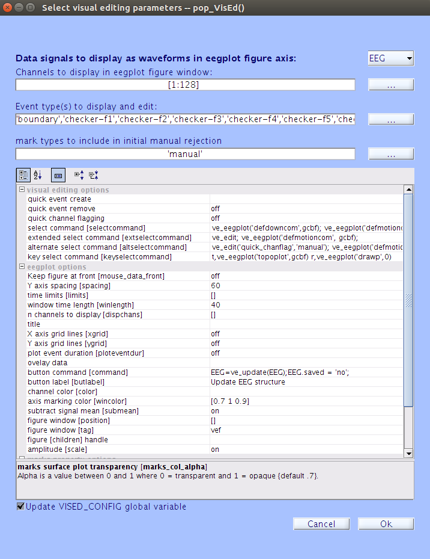
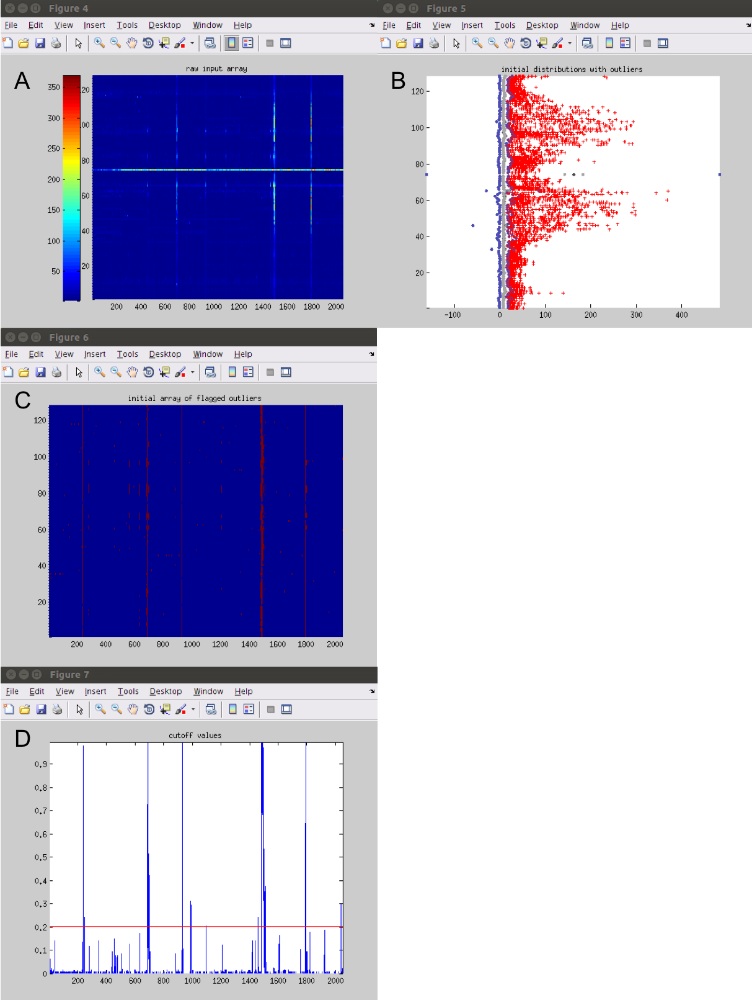
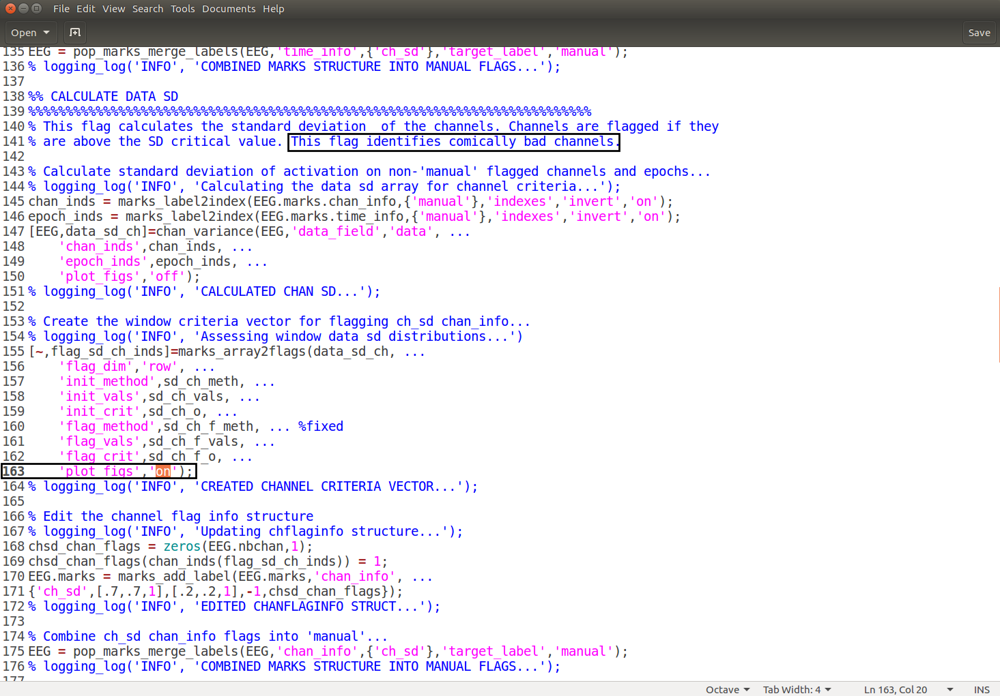

## Running the localParam.m Script

Prior to running the data through the pipeline, optiminal parameters can be determined by running the `localParam.m` script on a loaded data file. This script is a version of the `s01` pipeline script that is designed to be run locally. Running the script will add annotations to the file that enable you to quickly determine the impact of parameter edits and find optiminal values. After the script is run, the annotations added to the EEG channel scroll plot can be visually inspected. This will allow for the determination of whether appropriate parameters were used based on the decisions that were made about channels and epochs. 

Channels that are artefactual for most of the file should be identified by the pipeline and marked for removal. Channels that are only artefactual for short periods of time such as channels that contain eyeblinks should remain in the data. The artefacts in these channels (including the eyeblinks) can be isolated into a component that can then be marked for removal. Decisions about channels **can not** be edited during the QC procedure and as such, parameters will have to be edited in order to change channel decisions. 

Decisions about time can be edited by the reviewer during the QC procedure, however, it is still important to ensure that the pipeline is making appropriate decisions about time. Epochs that have been marked for removal by the pipeline should be artefactual. 

1. Open MATLAB and navigate to your **local** project directory to make it your current path.

2. Open EEGLAB by typing the following into the command window:
 
    ```matlab
    >> addpath derivatives/BIDS-Lossless-EEG/code/install
    >> lossless_path
    >> eeglab
    ``` 

3. If you are using an older version of MATLAB (pre-2014b), you will need to set the default figure renderer to OpenGL by typing the following into the command window:

    ```matlab
    >> set(0,'DefaultFigureRenderer','OpenGL');
    ``` 

4. In the EEGLAB drop-down menu, navigate to **Import data-> Using EEGLAB functions and plugins-> From BIDS subject folder**. In the file chooser navigate into the `sub-001/eeg` directory, select the `sub-001_task-faceFO_eeg.set` file and press open. 

5. Once the file has loaded, run the localParam.m script by typing the following into the command window:

    ```matlab
    >> localParam
    ``` 

6. The script will display 'Done!' in the command window when it has completed. The script made decisions about the data using the default parameters in the `localParam.m` script. To visualize the decisions that have been made, navigate in the EEGLAB drop-down menu to **Edit** and press **Visually edit in scroll plot.**

7. In the **Select visual editing parameters** pop-up window, type `60` in the `Y axis spacing [spacing]` field and `40` in the `window tine length [winlength]` field. The window should look like this:

    

8. Press enter after you finish inputting the values to ensure that they have been saved. Then press the `Ok` button. This will load a window containing the **EEG channel** data.

9. The script has added annotations to the file that show the decisions the script has made. These decisions are based off of the parameters. First look at the decisions that have been made about channels. Channels that have been marked artefactual are shown in gray and have a gray `manual` flag and a coloured flag on the left side of the data window. In this example, there are several channels that have been marked as artefactual with annotation `ch_sd`. These are channels that have been found to be artefactual on the basis of channel voltage variance based on the channel decisions criteria that was introduced in the previous episode. 

10. Scroll through the file to see the decisions that have been made about time. There is a period of time at 230s that has been marked for removal because of large artefacts across most channels. 

## Editing Parameters

1. To edit the parameters, navigate to the localParam.m script (Face13/derivatives/BIDS-Lossless-EEG/code/scripts/localParam.m) and open the file in a plain text editor. 

2. The parameters are located at the top of this file. A description and the default value for each parameter can be found on the [Lossless pipeline wiki](https://github.com/BUCANL/BIDS-Lossless-EEG/wiki/Pipeline-Scripts#scalpart-s01).

3. To investigate the impact of editing parameters, change the value for the `sd_ch_o` parameter to **4**. This parameter is located on line 17 and the default value of this parameter is 16. Be sure the save the changes that have been made. 

> ## What will the impact of lowering the `sd_ch_o` parameter be?
> 
> Before you visually inspect the data, what do you think the outcome of the parameter edit will be? Will editing this parameter change the decisions that are made regarding epochs or channels? Will the script mark more or less as artefactual? 
> 
> {: .source}
>
> > ## Solution
> >
> > The `sd_ch_o` parameter is related to outlier detection for channels and is the factor to multiple against the median to quantile distance to determine outliers. Lowering this value will make the critical distance for determining outliers smaller and therefore more channels will be marked as artefactual.
> >
> > {: .output}
> {: .solution}
{: .challenge}

4. If you would like to make a direct comparsion between the different parameters, you may leave the scroll plot open. Otherwise, you can close this scroll plot before running the localParam.m script with edited parameters.

5. To prepare for running the edited localParam.m script, the file and workspace memory need to be cleared. To do this, first navigate in the EEGLAB drop-down menu to **File** and click **Clear study/Clear all**. 

6. In the Matlab Command Window, type **clear**. This should clear all of the variables from memory. 

> ## Steps for between each run of the localParam.m script 
>    
> Steps 4-6 should be repeated between any runs of the localParam.m script.
>
> {: .source}
{: .callout}

7. Run the localParam.m script by typing the following in the command window:

    ```matlab
    >> localParam
    ``` 

8. The script will display 'Done!' in the command window when it has completed. To visualize the decisions that have been made, navigate in the EEGLAB drop-down menu to **Edit** and press **Visually edit in scroll plot.**

9. Investigate the channels that have been marked as artefactual, focusing on the `ch_sd` mark. In the scroll plot, it is evident that lowering the `sd_ch_o` parameter resulted in more channels being marked as artefactual. Looking at the channels that have been marked, it can be seen that many of the channels are not truly artefactual and as such should not be marked for removal. This is an indication that the lowered parameter is not ideal for this dataset and the default value was more optimal. 

> ## Editing other parameters 
>    
> Other parameters in the localParam.m script can be edited by repeating this procedure. For example, the parameters `sd_t_o` and `sd_t_f_o` can be edited to change the time decision criteria function. The `sd_ch_f_o` parameter can also be edited to change the channel decision criteria function. The `low_bound_hz` and `high_bound_hz` parameters are for filtering and can be edited to change the filtering that is applied to the data. 
>
> {: .source}
{: .callout}

## Investigating Decision Making Criteria Figures

1. The output figures for the time and channel decision criteria functions that were introduced in the previous episode can be plotted while running the localParam.m script. To plot the figures, navigate to the localParam.m script (Face13/derivatives/BIDS-Lossless-EEG/code/scripts/localParam.m) and open the file in a plain text editor. 

2. Scroll through the script until you reach the **Calculate Data SD** that says **identifying comically bad epochs**. In the script there will be a line that says `'plot_figs' 'off'`, to plot the figures change the `off` to `on`. Ensure that the changes have been saved. The script should look like this:

    

> ## Starting a new Matlab session 
>    
> Note that if you are starting a new Matlab session you will need to complete steps 1-3 from the beggining of this episode to set the path for and open EEGLAB.
>
> {: .source}
{: .callout}

3. In the EEGLAB drop-down menu, navigate to **Import data-> Using EEGLAB functions and plugins-> From BIDS subject folder**. In the file chooser navigate into the `sub-001/eeg` directory, select the `sub-001_task-faceFO_eeg.set` file and press open. 

4. Once the file has loaded, run the localParam.m script by typing the following into the command window:

    ```matlab
    >> localParam
    ``` 

5. The script will display 'Done!' in the command window when it has completed. The script will have printed out 4 figures as it ran. These figures represent that same time decision criteris from the pervious episode but show the decisions that are being made with the current parameters on the loaded file from the Face13 dataset. 



While trying to determine optiminal parameters for a dataset it can be helpful to plot the figures to see how parameter edits influence the different steps in the decisions making criteria function. 

> ## Investigating Channel Decision Making Criteria 
>    
> The figures for the **channel** decision making criteria can also be plotted. The decision criteria for channels is located below the time decision criteria in the script. The line that says `'plot_figs' off'` needs to be changed to say `'plot_figs' on'`. The script should look like this:
> 
> .
>
> {: .source}
{: .callout}




---
