## Decision Flow Chart

The below figure represents an example decision making process for determining the actions a reviewer should take when encountering an artefact in the data.

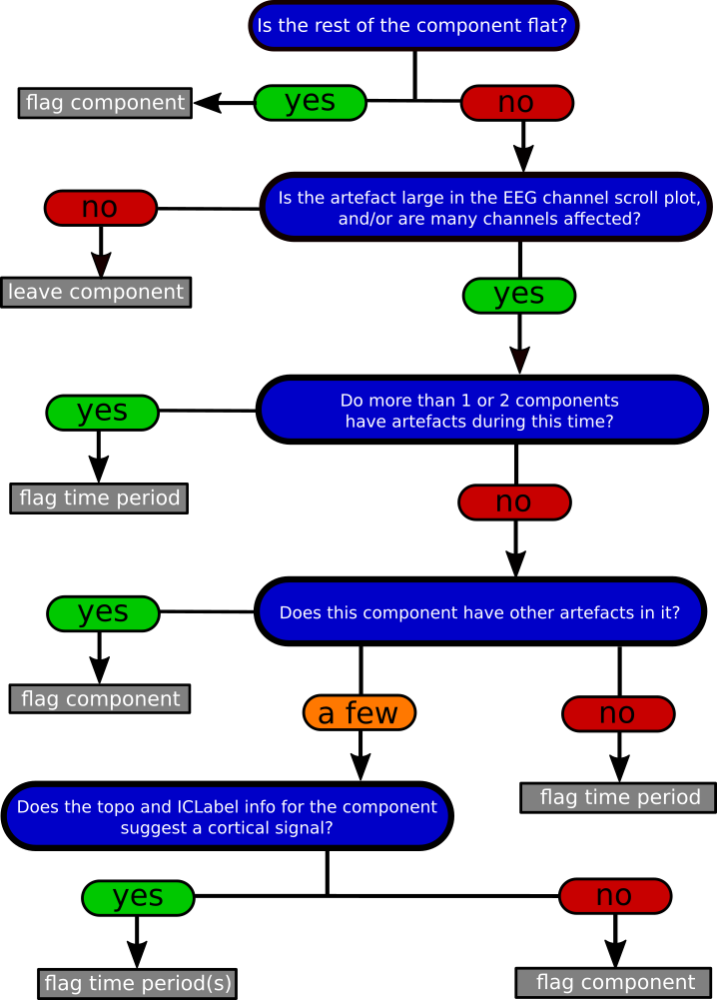{:height="580px" width="408px"}

> ## Note
> This flow chart is meant to be used as a guide only. Ultimately, **the reviewer** will be the one to make the final call on what decision to make.
>
> {: .source}
{: .callout}

## Examples

> ## Case 1
> 
> Component has an artefact and the rest of the component is flat.
> 
> {: .source}
>
> > ## See flow chart
> > 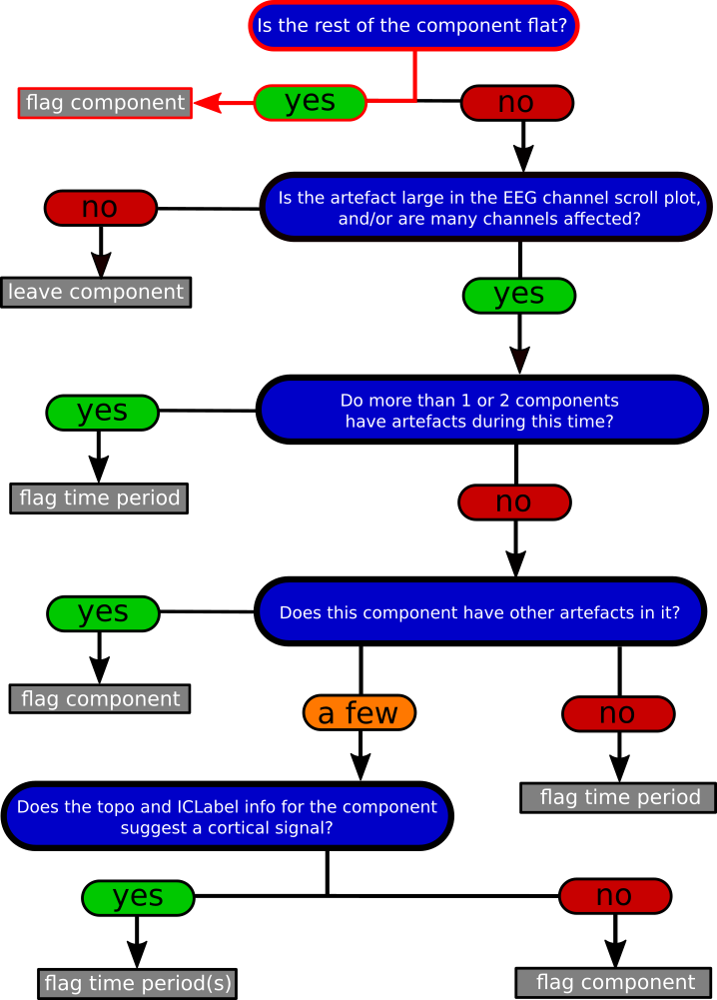{:height="580px" width="408px"}
> >
> > {: .output}
> {: .solution}
>
> > ## Example A
> >
> > 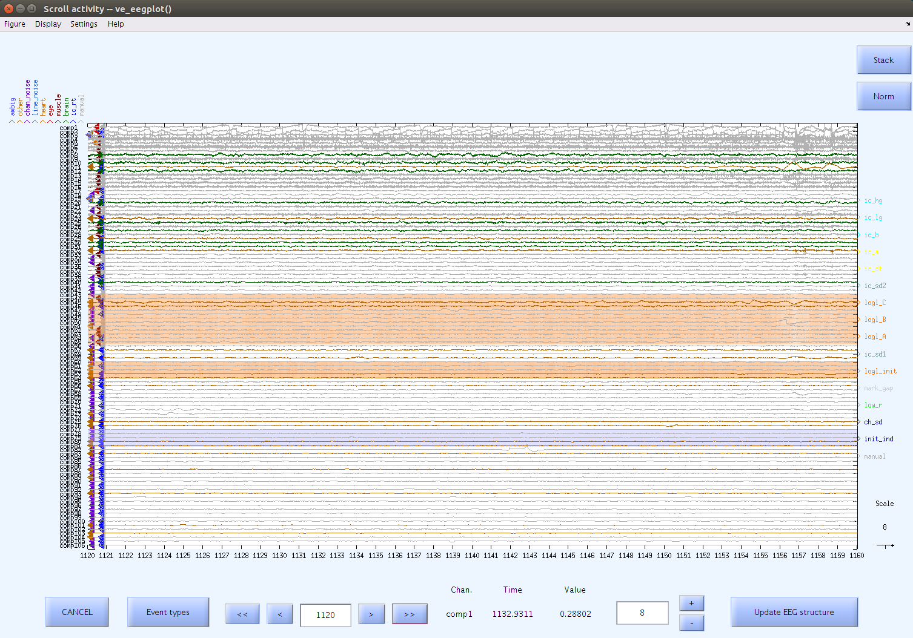
> > Component 11 in this example has a large artefact that is affecting the EEG channel data and the rest of the component is flat. Because the rest of the component does not appear to contain much cortical data, it is preferable to remove the component with the isolated artefact compared to removing time. 
> >
> > To remove this component, hover over it and right click the mouse. This will add a manual mark to the component and will gray it out.
> >
> > {: .output}
> {: .solution}
>
> > ## Example B
> >
> > 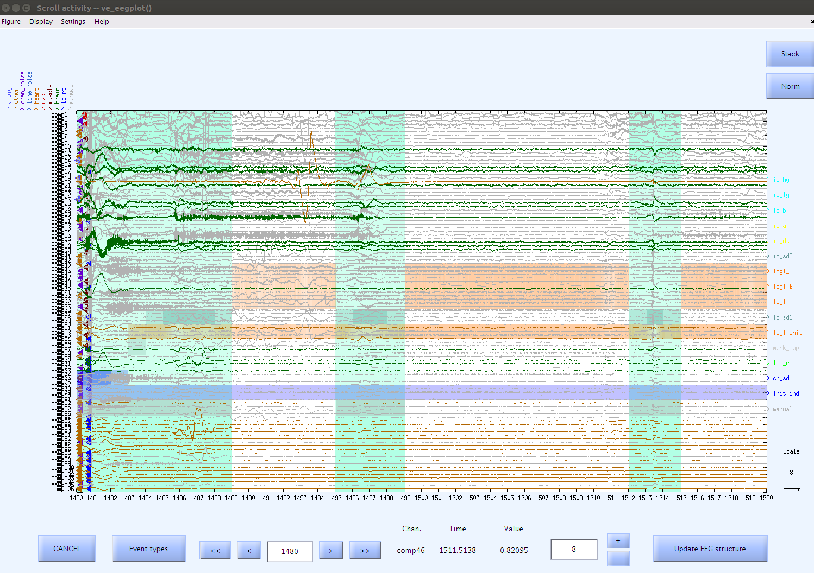
> > There is a large artefacts in component 20 and this component is otherwise flat. It would be preferable to remove the component over removing time because the artefact is isolated.
> >
> > To remove this component, hover over it and right click the mouse. This will add a manual mark to the component and will gray it out.
> > 
> > {: .output}
> {: .solution}
>
> > ## Example C
> >
> > 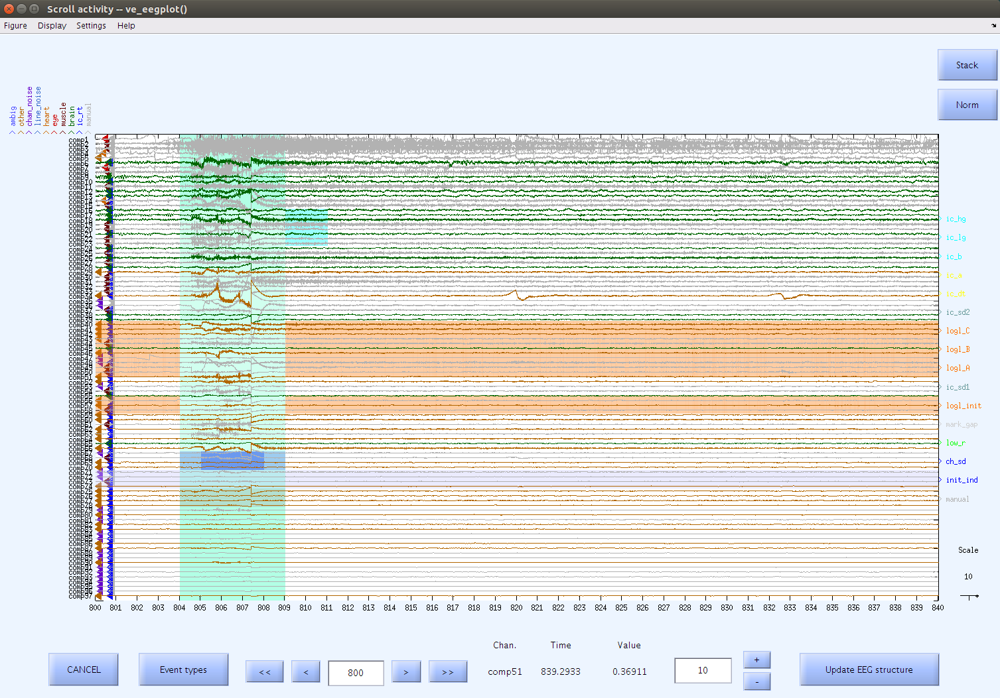
> > Component 34 has a couple large artefacts, and is otherwise quite flat. The waveform doesn't suggest cortical activity and the overlay shows that removing this component only appears to remove the artefacts without visibly removing any good cortical data. Removing the component is the best decision here.
> >
> > To remove this component, hover over it and right click the mouse. This will add a manual mark to the component and will gray it out.
> >
> > {: .output}
> {: .solution}
{: .challenge}

> ## Case 2
> 
> The component is not flat, but the artefact is relatively small and might be coming from a true cortical source and a small number of channels are affected.
> 
> {: .source}
>
> > ## See flow chart
> > 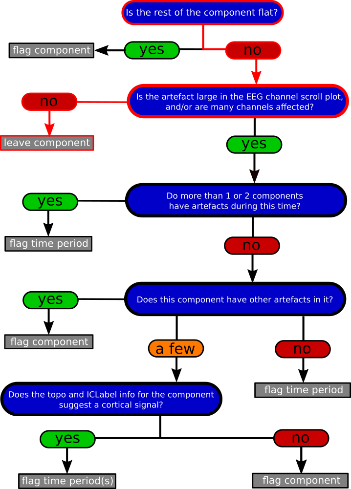{:height="580px" width="408px"}
> >
> > {: .output}
> {: .solution}
>
> > ## Example A
> >
> > 
> > At 1141 seconds, there is what appears to be an artefact in component 11. However when looking at the EEG channel data, there is no significant artefact at this time point. Using the projected overlay is particularly helpful for determining that data with the remaining components is clean. Because the EEG channel data appears to be within a reasonable range across all channels at that time point, we can leave the component and time period in.
> >
> > {: .output}
> {: .solution}
{: .challenge}

> ## Case 3
> 
> The component is not flat, the artefact is large and/or affects many channels and components.
> 
> {: .source}
>
> > ## See flow chart
> > 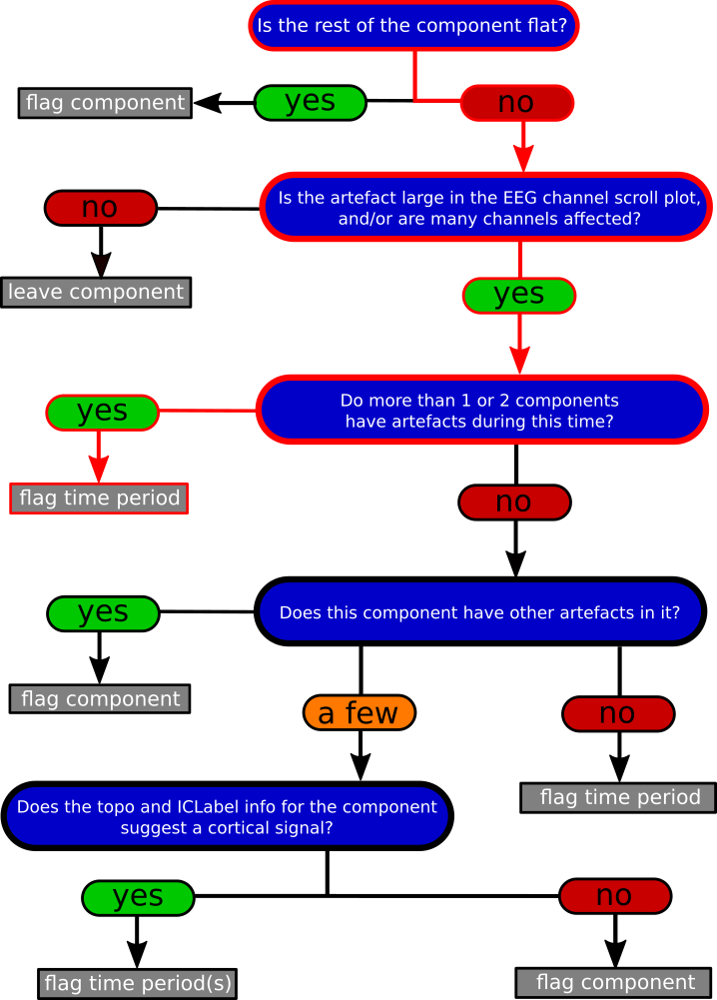{:height="580px" width="408px"}
> >
> > {: .output}
> {: .solution}
>
> > ## Example A
> >
> > 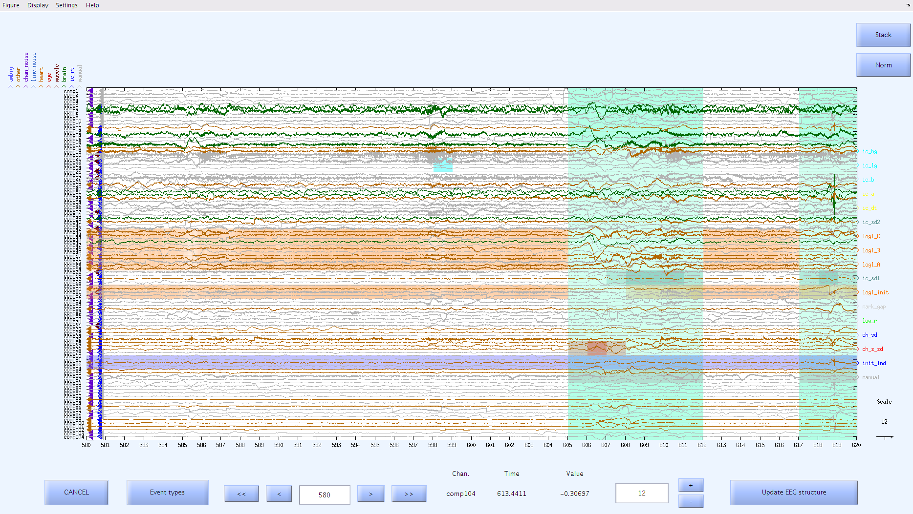
> > During the time periods around 585-587 seconds and 597-599 seconds, there are several components that contain artefacts. For these time periods, we would answer no to the first question because several components that have artefacts are not flat. For the second question, we would answer yes because several channels are being affected by these artefacts in the scalp EEG data. For the third question, we would answer yes because there are multiple components with artefacts during this time period. In this example, we would prefer to flag the time period for removal over removing every component that has an artefact. We would have to remove too many components in order to clean up this time period so it is better to remove the time period instead. We can also use the orange AMICA marks to help make this decision. The lighter highlight that is seen during this time period indicates that the three parallel AMICA procedures did not replicate during this time period. The orange AMICA bar is oftern lighter during artefactual time periods so this mark can be used as an indicator of artefactual time periods.
> >    
> > To mark out a time period, left click the mouse at the start of the time period that you want to mark for removal and then move the mouse to end of the time period and left click again. This will add a blue highlight to the time period. Then hover over the time period and click **'m'** on the keyboard to add a manual mark to this time period.
> > 
> > {: .output}
> {: .solution}
>
> > ## Example B
> >
> > 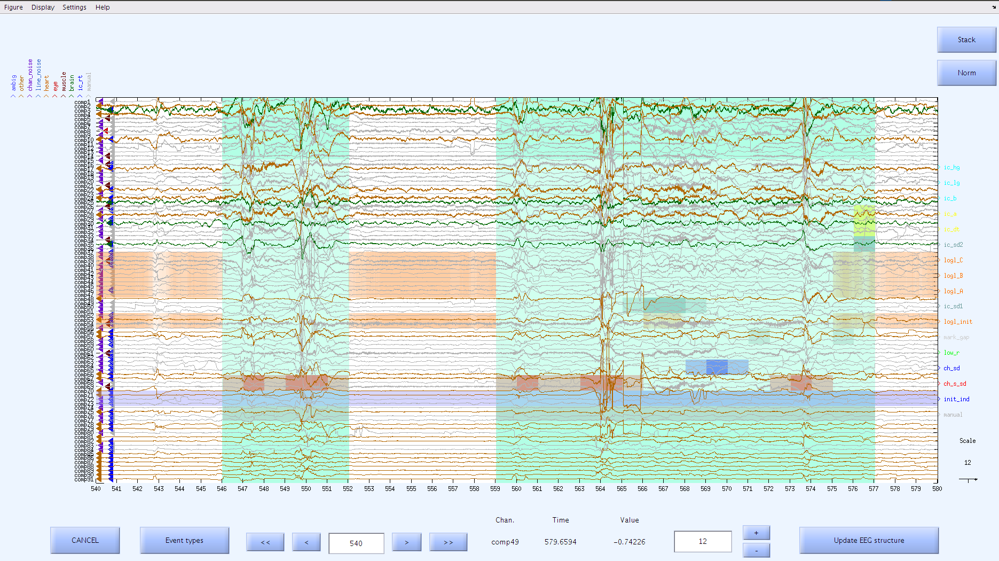
> > At the time period around 542-544 seconds, several components have artefacts and the AMICA orange highlight is lighter during this period. Removing this time period would be the best decision here.
> >    
> > To mark out a time period, left click the mouse at the start of the time period that you want to mark for removal and then move the mouse to end of the time period and left click again. This will add a blue highlight to the time period. Then hover over the time period and click **'m'** on the keyboard to add a manual mark to this time period.
> >
> > {: .output}
> {: .solution}
{: .challenge}

> ## Case 4
> 
> The component is not flat, the artefact is large and/or affects many channels, but it is isolated to one or two components which also have other artefact in them.
> 
> {: .source}
>
> > ## See flow chart
> > 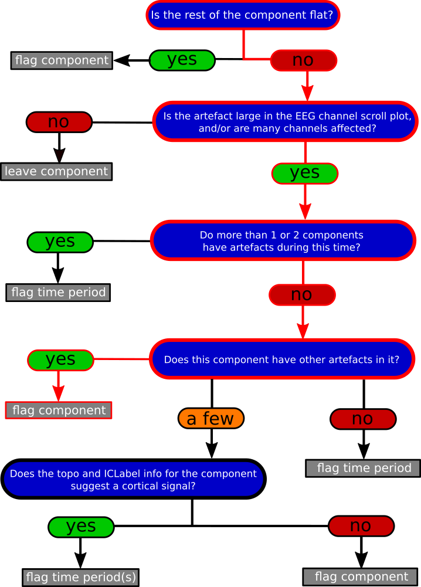{:height="580px" width="408px"}
> >
> > {: .output}
> {: .solution}
>
> > ## Example A
> >
> > 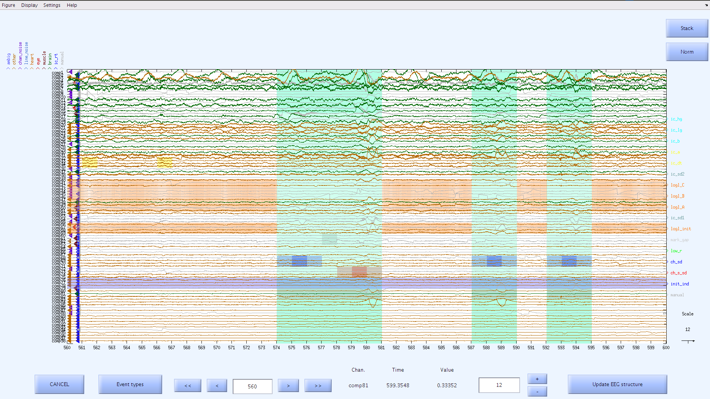
> > 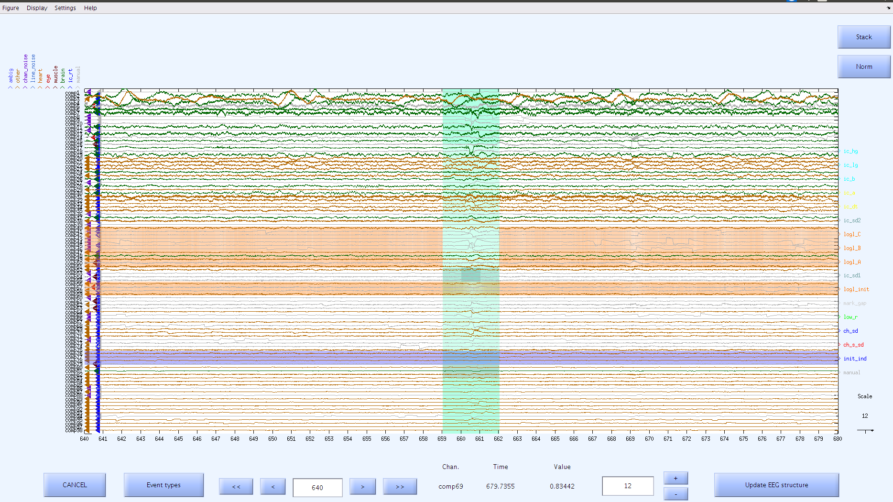
> > The top cortical components are mixed with slow waves (sweat artefacts). This is an ambiguous case because on the one hand we definitely want to remove the sweat artefacts, but on the other hand we don't want to remove any cortical data. In this case we would lean towards removing these components, but we ultimately need to decide whether or not too much good cortical data appears to be removed from the scalp waveforms based on visual inspection of the projected overlay.
> >     
> > If we use the flow chart on the top two components, we would answer no to the first question because the rest of the components aren't flat. We would answer yes to the second question because the artefacts are substantially affecting the EEG channel data, and we would answer no to the third question because for most of the time periods, it is only two components that have large artefacts. The components contain artefacts that are continually affecting the EEG channel data, so we would answer yes to question 4, which leads to marking the components as ambiguous and flagging them for removal. The artefacts are occurring too often, so removing the time period for each artefact is not an option. Although the component does appear to contain what appears to be good cortical data, in this case it is best to remove these components because the resulting projection does not appear to visibly affect areas of good cortical signal, meaning we are losing little to no cortical signal by removing these components. 
> >
> > To remove this component, hover over it and right click the mouse. This will add a manual mark to the component and will gray it out.
> > 
> > {: .output}
> {: .solution}
>
> > ## Example B
> >
> > 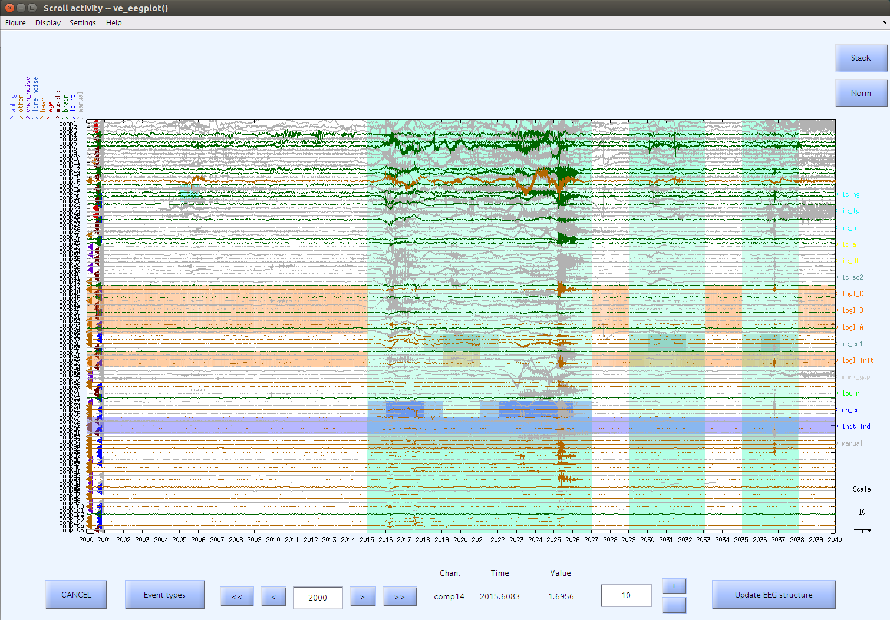
> > Component 16 has an artefact between 2005-2007 seconds. It also contains a number of other artefacts throughout the file and the component does not visibly appear to contribute any cortical data, based on the overlay projection. In this case, it is best to remove the component.
> >
> > To remove this component, hover over it and right click the mouse. This will add a manual mark to the component and will gray it out.
> >
> > {: .output}
> {: .solution}
>
> > ## Example C
> >
> > 
> > Although component 5 may look like it contains some cortical signal, there is a clear regular spike appearing a couple times per second, which suggests a heart artefact. This is affecting many good channels throughout the entire recording, and also removing the artefact does not appear to affect the cortical signal when inspecting the overlay in the channel scroll plot, so it is best to remove the component.
> >
> > To remove this component, hover over it and right click the mouse. This will add a manual mark to the component and will gray it out.
> >
> > {: .output}
> {: .solution}
>
{: .challenge}

> ## Case 5
> 
> The component is not flat, the artefact is large and/or affects many channels, but it is isolated to one or two components with no other artefacts in them.
> 
> {: .source}
>
> > ## See flow chart
> > 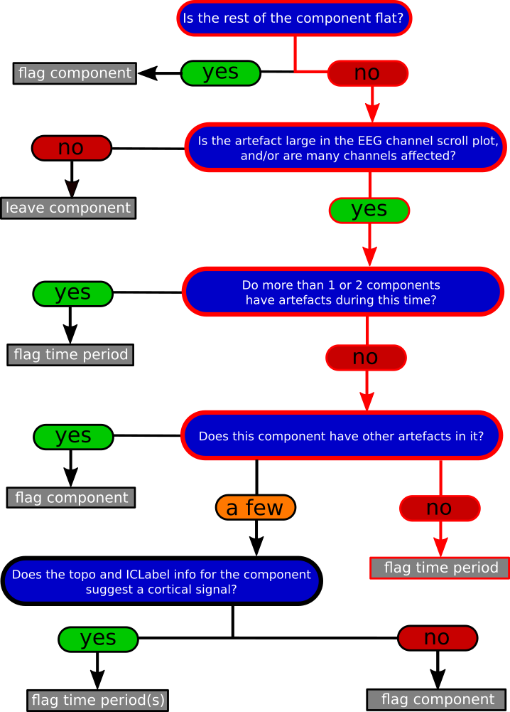{:height="580px" width="408px"}
> >
> > {: .output}
> {: .solution}
>
> > ## Example A
> >
> > 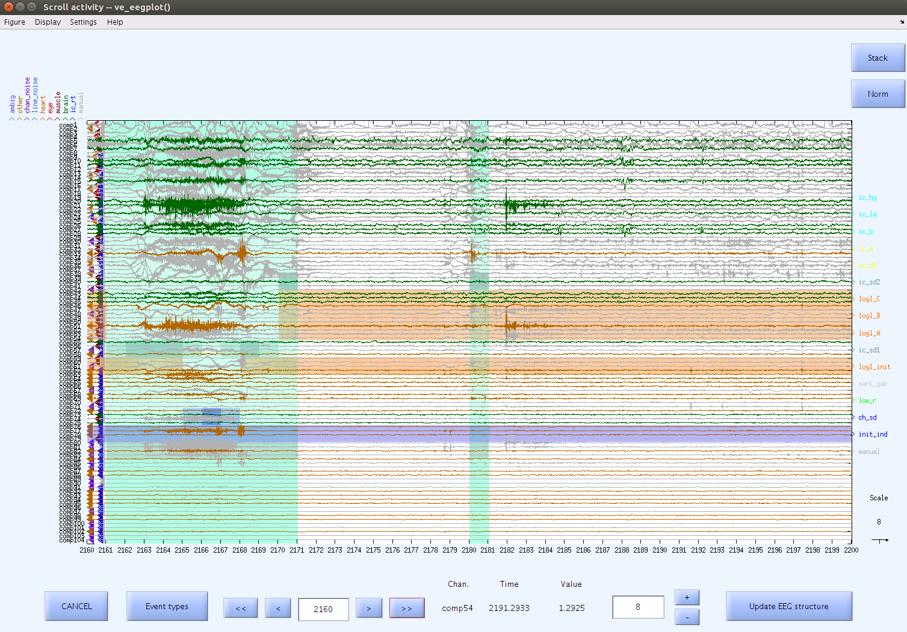
> > Components 21 and 51 appear to have at least some good cortical data in them, and they maintain a fairly consistent signal throughout the recording, but at 2181-2183 seconds there is a brief but sharp spike in the component activation. Removing these components would likely be removing good cortical data, so in this case it would be best to remove the time period instead.
> >    
> > To mark out a time period, left click the mouse at the start of the time period that you want to mark for removal and then move the mouse to end of the time period and left click again. This will add a blue highlight to the time period. Then hover over the time period and click **'m'** on the keyboard to add a manual mark to this time period.
> >
> > {: .output}
> {: .solution}
{: .challenge}

> ## Case 6
> 
> The component is not flat, the artefact is large and/or affects many channels, it is isolated to one or two components with only a few other artefacts in them, but the topos and ICLabel info for the components do not suggest a cortical signal.
> 
> {: .source}
>
> > ## See flow chart
> > 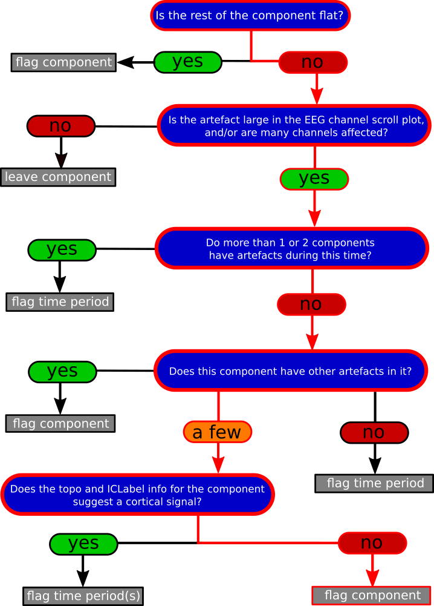{:height="580px" width="408px"}
> >
> > {: .output}
> {: .solution}
>
> > ## Example A
> >
> > 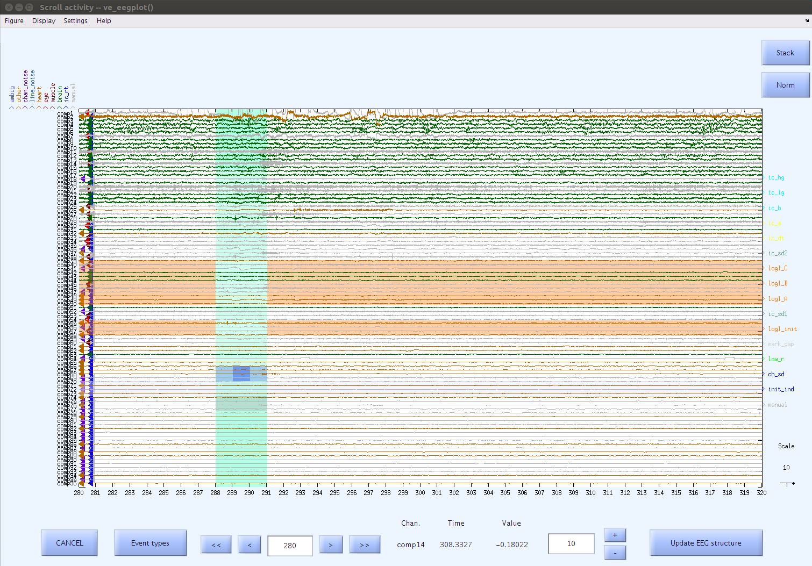
> > 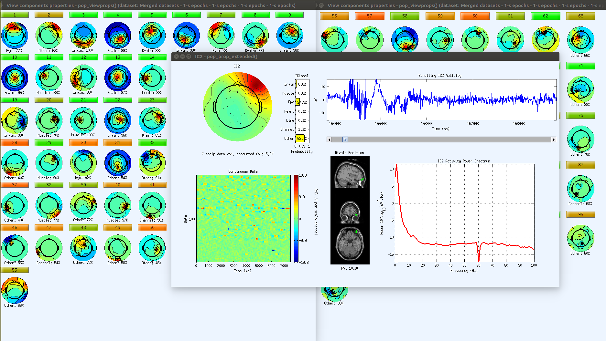
> > Component 2 has a period of square waves at the time period between 292-298 seconds. The topographical data suggests that this is likely an eye component and the overlay waveforms are not affected much by removing this component other than getting rid of the artefact from the affected channels. The best decision here would be to remove the component.
> >
> > To remove this component, hover over it and right click the mouse. This will add a manual mark to the component and will gray it out.
> >
> > {: .output}
> {: .solution}
> >
> > ## Example B
> >
> > 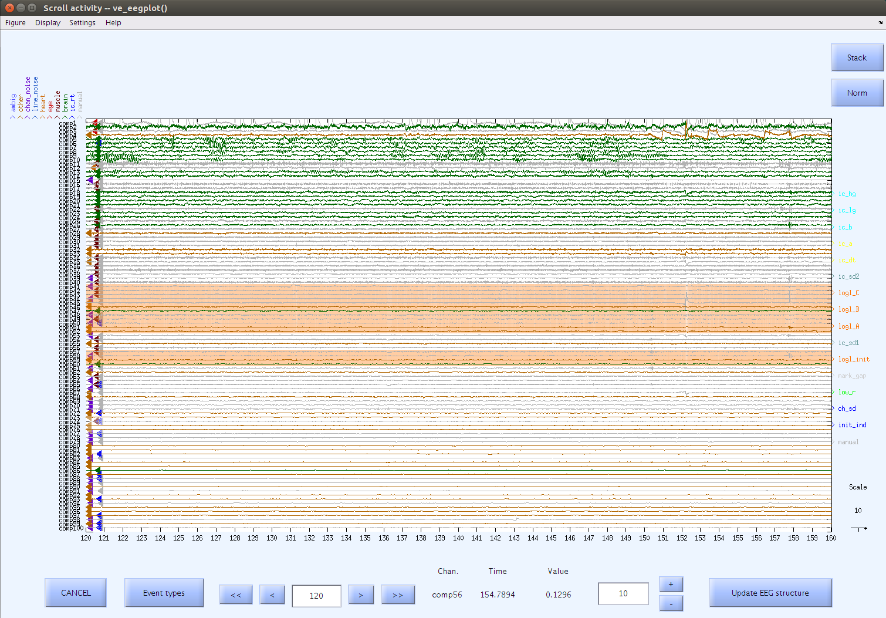
> > 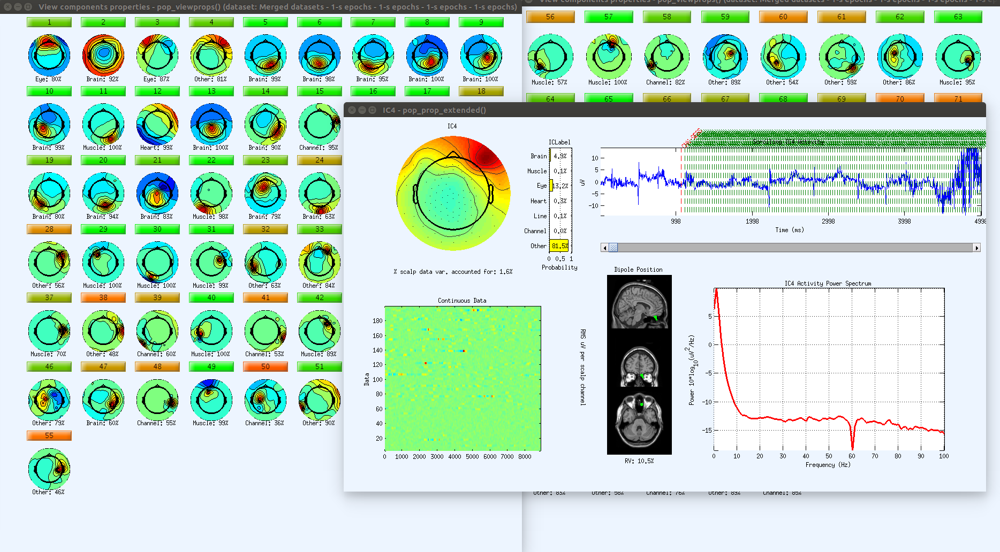
> > Component 4 has a period of square waves at the time period between 150-159 seconds. The topographical data suggests that this is likely an eye component and the overlay waveforms are not affected much by removing this component other than getting rid of the artefact from the affected channels. The best decision here would be to remove the component.
> >
> > To remove this component, hover over it and right click the mouse. This will add a manual mark to the component and will gray it out.
> >
> > {: .output}
> {: .solution}
{: .challenge}


