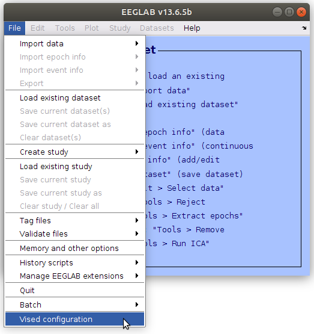
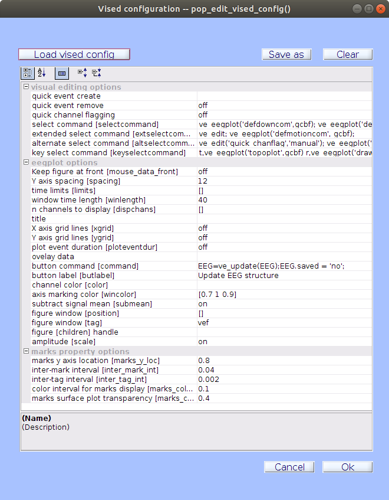
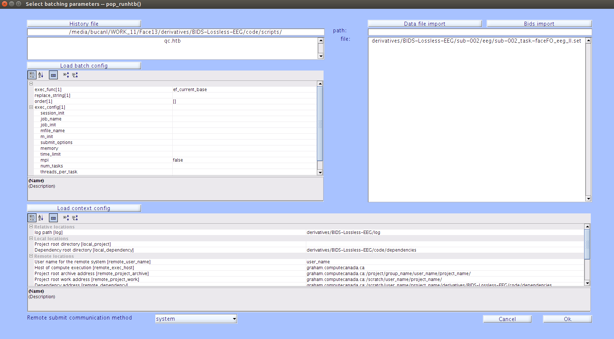

## Running the Quality Control Script 

Now that we are familiar with the quality control procedure, we can practice interacting with and making decisions about the data. To do this, we will run the QC script on the file for sub-002 from the Face13 dataset.

1. Open MATLAB (pre-2014b works fastest) and change your **Current Folder** by navigating to the Lossless pipeline root directory (in this case, `Face13`).

2. Open EEGLAB by typing the following into the command window:

    ```matlab
    >> addpath derivatives/EEG-IP-L/code/install
    >> lossless_path
    >> eeglab
    ```

3. If you are using an older version of MATLAB (pre-2014b), you will need to set the default figure renderer to OpenGL by typing the following into the command window:


    ```matlab
    >> set(0,'DefaultFigureRenderer','OpenGL');
    ```

4. In the main EEGLAB window, navigate to **File->Vised Configuration**. 

    

5. Add the vised configuration file by clicking `| Load vised config |` and then navigate to the config folder (`derivatives/EEG-IP-L/code/config/`). Select the file named `vised_config_qc.cfg`, and click `| OK |`. The vised configuration file will load certain settings that are preferable for the quality control (QC) procedure.

    

6. In the main EEGLAB window, navigate to **File->Batch->Run History Template Batch**.


7. In the **Run History Template Batch** window, add a Context configuration file by clicking `| Load context config |`. The default file will be sufficient for this task: `derivatives/EEG-IP-L/code/config/contextconfig.cfg`. 

8. Click `| History File |` and add the `qc.htb` script located in `derivatives/EEG-IP-L/code/scripts/`.

    > ## Note 
    > The `qc.htb` script is optimized to be run with a three monitor setup. If you do not have access to three monitors you should load the `qc_lite.htb` script located in `derivatives/EEG-IP-L/code/scripts/`.      
    > 
    > {: .source}
    {: .callout}

9. Open up a terminal window, and navigate to your project root directory:

    `>> cd path/to/project/directory/Face13`

10. In the terminal, list all the data files you would like to run through the QC procedure. This can be done using the find command. If using the BIDS directory structure, simply type:

    `>> find derivatives/EEG-IP-L -name "*_ll.set"`

12. This will print a list of all the files that have run through the pipeline. For this exercise, copy the .set file for **sub-002** from the terminal into the **file** field in the **Run History Template Batch** window. The history template batch window should look like this:

    

13. Click `| Ok |` to start the QC batch process.

## Interacting with the Data

Once all of the topographies have loaded, we can begin interacting with and making decisions about the data. In a new study, the first thing you would look at are the decisions the pipeline has made about your data. These decisions are made based on parameters in the batch configuration files. Parameters have already been optimized for the Face13 dataset but for new studies, the pipeline decision criteria has to checked. You want to make sure that you agree with the decisions that are being made. If you do not agree, parameters can be edited to change these decisions. Information on decision criteria and editing parameters can be found in the [Parameters tutorial](https://bucanl.github.io/SDC-LOSSLESS-PARAMS/).

1. The main window that we will be interacting with during QC is the **component** data window. In this window, locate component 3. This component contains noise from one channel. The topography for this component allows us to identify the general location of this noisy channel.

2. In the **channel** data window, identify the channel that contains the noise isolated in component 3.

    > ## Solution
    > The channel containing the noise is channel B10.
    >
    > {: .source}
    {: .solution}

3. To turn on the overlay, first click on the top of the EEG **channel** window to make it your current focus. Then, press **'o'** to turn on the overlay. The overlay will add a gray signal on top of the blue signal for each channel. Data in blue is the EEG channel data without artefacts removed. Data in gray is a projection of only the remaining components back to the scalp. The remaining components are those that do **not** have a manual mark. The gray overlay reflects the changes made by rejecting various components and is the data that would be remaining following purging components that have a manual mark.

    > ## Note
    > When clicking a window to make it your current focus, click on the bar at the top of the window. This prevents accidentally selecting a time period in the window.
    >
    > {: .source}
    {: .callout}

4. To remove the artefactual component, click on the top of the **component** window to make it your focus, hover over component 3 and right-click on the mouse. This will add a manual flag to the component and the component will now be shown in gray.

    > ## Editing Events Pop-up
    > If you right-click on an event marker when you are trying remove a component, a pop-up window will appear. Click **cancel** in the window to close this pop-up and retry right-clicking a component where there is not an event marker.
    >
    > {: .source}
    {: .discussion}

5. Since components that have a manual mark are not included in the gray overlay, if we update the overlay, the data from component 3 will no longer be included. To update the overlay, click on the top of the EEG **channel** window to make it your current focus and press **'u'**. With the updated overlay, we can see that the channel noise for B10 has been removed by marking component 3 manual.  

6. This time window does not contain any more artefacts so we can move on to the next time window. To move forward press the `>>` button on the **component** data window. Pressing this button will move both the component and the channel windows forward 40 seconds.

    > ## Quality Control Method
    > The channel and component windows show a 40 second period. During the quality control procedure, you will scroll through the data and make decisions about removing artefacts by editing the annotations for time and components. For each time period shown, you should look through the components and channel data and identify if there are any artefacts present. When you come across an artefact you will make a decision on how to mark it for removal. 
    >
    > {: .source}
    {: .discussion}

7. Continue to scroll through the file and look for any artefacts. If you come across an artefact, refer to the decision flow chart in the [previous lesson](https://bucanl.github.io/SDC-LOSSLESS-QC/04-making_decisions_about_the_data/index.html) for help making a decision. 

    > ## Note
    > The Face13 dataset is very clean and as such most artefacts were able to be isolated into independent components. This means that there are not many decisions that need to made during the QC procedure for this dataset. 
    >
    > {: .source}
    {: .callout}

8. When you get to the end of the file, click the `Update EEG Structure` button on the component window. This will save the annotations that you edited and will output a *_qcr.set file. If you were running a batch of multiple files through the QC proceudre, pressing the `Update EEG Structure` button would save and close the current file and load the next file.




---
